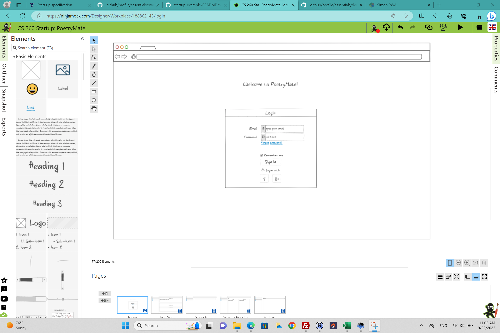
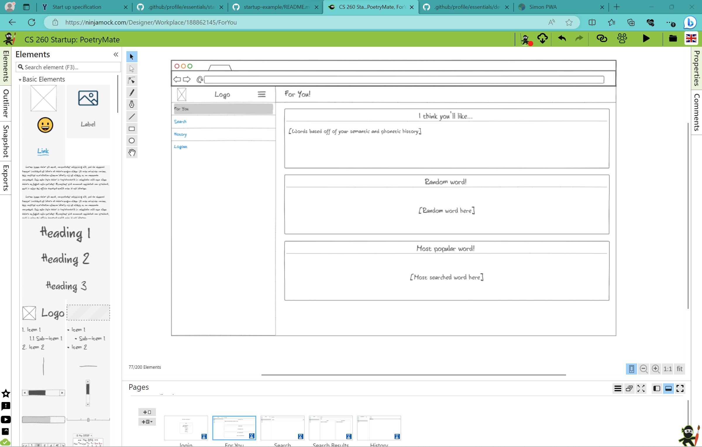
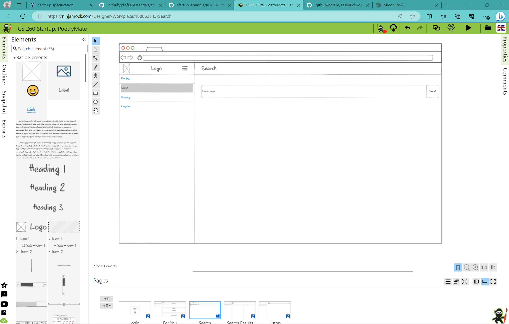
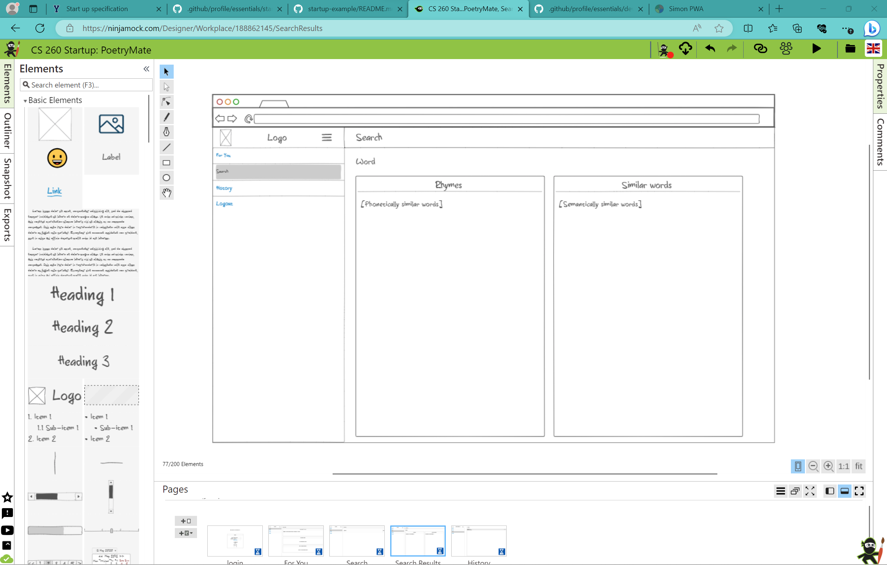
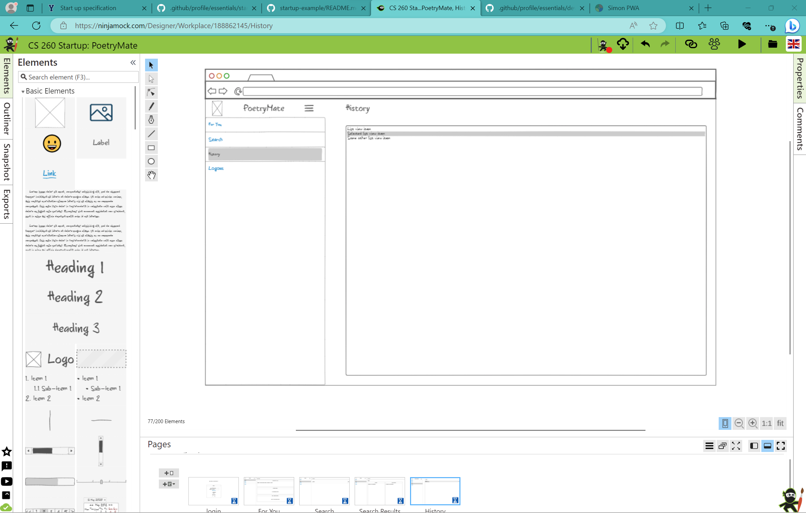

# PoetryMate
CS 260 Startup Project

## Description deliverable

### Elevator Pitch
There are a million tools to help writers improve their prose. But anyone composing poetry or song lyrics is stuck with relatively unsophisticated tools: there are rhyming dictionaries and thesauri to be found online, but not much else. PoetryMate will be a new tool that builds on previous capabilities. To find the perfect word, poets will be able to search any term, and then see words that are similar in either meaning (i.e., synonyms) or sound (i.e., rhymes). This will allow them to quickly sort through candidates to replace or be paired with their desired search term. Going a step further, PoetryMate will remember all of each user's searches and recommend words that they may find interesting in similar poetic works.  This new ensemble of linguistic tools will enhance the breadth, depth, accuracy, and efficiency of poets' lexical decisions. 

### Design
Each user will `login` to see his or her personalized `For You` page:

Doing any search will take the user to a `Search Results` page

Finally, the `History` page:

### Key features
- Secure login over HTTPS
- `Search` page: shows semantically and phonetically similar words (using thesaurus and phonetic encoding edit distance/rhyming dictionary)
- `History` page: shows past searches
- Clicking a word in `Search Results` or `History` performs a search with that word
- `For You` page: Shows recommended words, random word, and most searched words.
- Recommened words are the semantic and phonetically most similar words to the aggregation of your historically searched words

### Technologies
I will demonstrate the following required technologies:
- HTML will give the application its structure. There will be 5 pages total (as shown in [Design](Design) above), and links to all displayed on a side navbar.
- CSS will make the pages attractive and make the clickability of elements evident. The application will adapt to different screen sizes.
- Javascript will power login, search queries, and backend calls.
- Backend services will include:
  - login
  - wordlist (4MB) from [GitHub public repo](https://github.com/dwyl/english-words/blob/master/words_alpha.txt)
    - random word generator
  - thesaurus (18MB)  from [GitHub public repo](https://github.com/zaibacu/thesaurus/blob/master/en_thesaurus.jsonl)
  - phonetic transcriptions (3 MB) from [GitHub public repo](https://github.com/open-dict-data/ipa-dict/blob/master/data/en_US.txt)
    - Levenshtein edit distance calculator code [here](https://www.30secondsofcode.org/js/s/levenshtein-distance/)
  - database of past searches by user consulted by:
    - `History` page list of past queries
    - `For You` page list of recommended new words based on each specific user and based on all users
  - DB - stores users, past searches
  - Login - Register and login users, and store login credentials in database. Can continue as guest?
  - WebSocket - Real time updates to the `For You` and `History` pages
  - React - production builds will be done on react

## HTML Deliverable
I built the structure of PoetryMate in HTML
- **HTML pages** - structured all 5 pages for application: index.html (`Login`), foryou.html, history.html, search.html, searchResult.html
- **Links** - All pages except `Login` have links to all the other pages, except to `Search Results`, which can only be reached by the Search button from the `Search` page. `Login`'s Log in button links to `For You`
- **Text** - Placeholder for all future word data (from database and 3rd party calls). Headers and footers for all pages. 
- **Images** - Used an open source favicon image for browser attractiveness
- **Login** - Input boxes (one for email, one for password) and submit button for login
- **Database/WebSocket** - Placeholder data on `For You`, `History` and `Search Results` pages, which will dynamically update later

## CSS Deliverable
I styled the application, creating all relevant visual features for the end experience.
- **Header, footer, and main content** - Footer and header are banner-style elements with main content stacked in between.
- **Navigation elements** - Links are in the upper right corner, and are only underlined when moused over. Submit buttons are styled to theme.
- **Responsive to window resizing** - Using vw and vh as primary sizes took care of most resizing. For espcially small screen widths, the site name disappears.
- **Application elements** - Content is displayed in cards that divide up information. Blue and yellow theme colors help with foreground and background; so does box-shadows behind the content cards. Pages have animated transitions.
- **Application text content** - Found a nice font set and applied to all elements. Text contrasts correctly with background. Important text is larger/bolder/italic as appropriate.
- **Application images** - Pen emoji used as list bullet.

## Javascript deliverable
For this deliverable did a lot. I think I might have stepped a little bit over into the Login deliverable. The application is now fully interactive according to the issued specifications.
- **LocalStorage** has a record of every user that has logged in and their past searched words. It also has the currently logged in user.
- **Search** adds a searched word to the active user's historys and then moves to a `searchResult` papge where Rhymes and Similars are displayed (currently placeholder values).
- **clickability** on search and history. If you click any of the words, it searches it for you to make Wikipedia-like link chains.
- **For You** also has placeholder data, but algorithms are implemented for random word and most popular word.
- **Users** -- logging in will save your searches to your user. There isn't a password. You can also just press "sign in" to bypass.

## Service deliverable
- **Node.js/Express HTTP Servce** - done!
- **Static middleware for frontend** - done!
- **Third party service endpoints** - `For You` retrieves random words from a [random word API](http://random-word-api.herokuapp.com/home)
- **Backend service endpoints** provides history and login functionality and consistency
- **Frontend calls** `For You`, `History`, and `Search` pages call backend

## DB deliverable
- **MongoDB Atlas db created** - done!
- **Endpoints for data** - no longer just localStorage, now it sends to Mongo so you can login across machines
- **Stores data in MongoDB** - done!

## Login deliverable
A lot of this was already done by the architecture I set up in the JS deliverable, with just a few changes to incorporate the new technologies.
- **User registration** - creates a new account (with search history) in the database
- **existing user** - Stores history in the same user if one already exists
- **Use MongoDB to store credentials** - Stores user's name and words search
- **Restricts functionality** - You can search whenever you want, but history (and recommendations based off history) are only available if you give a username at login
- **I will revisit this to implement proper authorization!!**

## WebSocket deliverable
For this deliverable I decided to convert one of the regions in the `For You` section from "most popular word" to "most recently searched word." I thought it would fulfill a similar niche: showing users what other users are up to. It's pretty cool since it updates in real time as other users search words, almost like a chatbox.
- **Backend listens for WebSocket connection** - this happens in `peerProxy.js`
- **Frontend makes WebSocket connection** - all of my frontend pages that are capable of searching do this.
- **Data sent over WebSocket connection** - this works. It sends the word that was searched
- **WebSocket data displayed** - In the `Recently Searched Word!` box on the `For You` page, it displays the word most recently searched, as well as the username of the user who searched it. You can click the box to search the word, too.

## React deliverable
For this deliverable I converted everything I had done into React components. I also got rid of all the placeholder data so the app is fully operational. When I first uploaded it to the website, it didn't work at all. I had to spend a couple of hours debugging that :( But it works!
- **Bundled and transpiled** - done! I just followed what Simon did.
- **Components** - merged each pair of js and html files into a jsx component file. Sweet.
- **Router** - Routing goes between `Login`, `For You`, `Search`, and `History`. Clicking any of the words will search them!
- **Hooks** - I use `useState` and `useEffect` where appropriate. I don't know if it's a hook, but I also use React's `useNavigate` for the `onClick` functions to search.